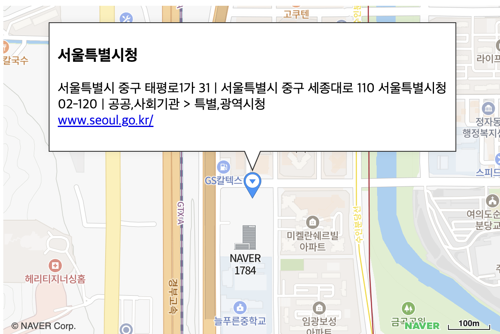

# 정보 창 표시하기

마커에 정보 창을 표시하는 예제입니다.



```svelte
<script>
import { NaverMap, NaverMarker, NaverInfoWindow, createMapScript } from "svelte-naver-maps";

createMapScript({ clientId: "YOUR_NAVER_MAP_CLIENT_ID" });

let open: boolean = true;

const onMarkerClick = () => {
  open = !open;
};

const mapOptions = {
	width: "100%",
	height: "400px",
	latitude: 37.3849483,
	longitude: 127.1229117,
};

</script>

<NaverMap mapOptions={mapOptions}>
  <NaverMarker on:click={onMarkerClick} latitude={37.3595704} longitude={127.105399}>
      <NaverInfoWindow open={open}>
        <div class="iw_inner">
          <h3>서울특별시청</h3>
          <p>서울특별시 중구 태평로1가 31 | 서울특별시 중구 세종대로 110 서울특별시청<br />
            02-120 | 공공,사회기관 &gt; 특별,광역시청<br />
            <a href="http://www.seoul.go.kr" target="_blank">www.seoul.go.kr/</a>
          </p>
        </div>
      </NaverInfoWindow>
    </NaverMarker>
</NaverMap>

<style>
  .iw_inner {
    padding: 10px;
    background-color: white;
    border-radius: 5px;
    box-shadow: 0 0 10px rgba(0, 0, 0, 0.1);
  }
</style>
```