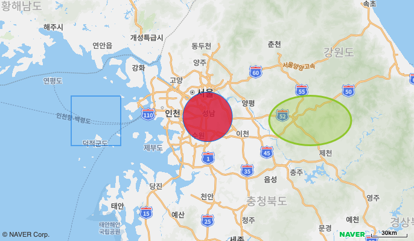

# 사각형, 원, 타원 그리기

지도 위에 좌표를 기반으로 사각형, 원, 타원을 생성하는 예제입니다.



```svelte
<script>
import { NaverMap, NaverCircle, NaverEllipse, NaverRectangle, createMapScript } from "svelte-naver-maps";

createMapScript({ clientId: "YOUR_NAVER_MAP_CLIENT_ID" });

const mapOptions = {
	width: "100%",
	height: "400px",
	latitude: 37.3595953,
	longitude: 127.1053971,
  zoom: 8,
};

const circleOptions = {
  radius: 20000,
  fillColor: 'crimson',
  fillOpacity: 0.8
};

const ellipseOptions = {
  strokeColor: 'yellowgreen',
  strokeOpacity: 1,
  strokeWeight: 3,
  fillColor: 'yellowgreen',
  fillOpacity: 0.3
};

</script>

<NaverMap mapOptions={mapOptions}>
  <NaverCircle latitude={37.3849483} longitude={127.1229117} circleOptions={circleOptions} />
  <NaverEllipse minLatitude={37.1793196} minLongitude={127.6795594} maxLatitude={37.5398662} maxLongitude={128.4312422} ellipseOptions={ellipseOptions} />
  <NaverRectangle minLatitude={37.1793196} minLongitude={125.8795594} maxLatitude={37.5398662} maxLongitude={126.3312422} />
</NaverMap>
```