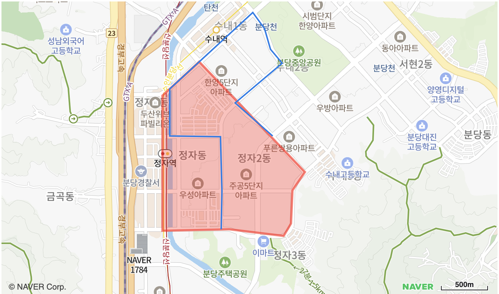

# 폴리곤, 폴리라인 그리기

지도 위에 좌표를 기반으로 폴리곤과 폴리라인을 생성하는 예제입니다.



```svelte
<script>
import { NaverMap, NaverPolygon, createMapScript } from "svelte-naver-maps";
	
createMapScript({ clientId: "YOUR_NAVER_MAP_CLIENT_ID" });

const mapOptions = {
	width: "100%",
	height: "400px",
	latitude: 37.3674001,
	longitude: 127.1181196,
  zoom: 14,
};

const polygonOptions = {
  fillColor: '#ff0000',
  fillOpacity: 0.3,
  strokeColor: '#ff0000',
  strokeOpacity: 0.6,
  strokeWeight: 3
};
</script>

<NaverMap mapOptions={mapOptions}>
  <NaverPolygon
    paths={[
      [
        { latitude: 37.37544345085402, longitude: 127.11224555969238 },
        { latitude: 37.37230584065902, longitude: 127.10791110992432 },
        { latitude: 37.35975408751081, longitude: 127.10795402526855 },
        { latitude: 37.359924641705476, longitude: 127.11576461791992 },
        { latitude: 37.35931064479073, longitude: 127.12211608886719 },
        { latitude: 37.36043630196386, longitude: 127.12293148040771 },
        { latitude: 37.36354029942161, longitude: 127.12310314178465 },
        { latitude: 37.365211629488016, longitude: 127.12456226348876 },
        { latitude: 37.37544345085402, longitude: 127.1122455596923 },
      ]
    ]}
    polygonOptions={polygonOptions}
  />
  <NaverPolyline 
    path={[
      { latitude: 37.359924641705476, longitude: 127.1148204803467 },
      { latitude: 37.36343797188166, longitude: 127.11486339569092 },
      { latitude: 37.368520071054576, longitude: 127.11473464965819 },
      { latitude: 37.3685882848096, longitude: 127.1088123321533 },
      { latitude: 37.37295383612657, longitude: 127.10876941680907 },
      { latitude: 37.38001321351567, longitude: 127.11851119995116 },
      { latitude: 37.378546827477855, longitude: 127.11984157562254 },
      { latitude: 37.376637072444105, longitude: 127.12052822113036 },
      { latitude: 37.37530703574853, longitude: 127.12190151214598 },
      { latitude: 37.371657839593894, longitude: 127.11645126342773 },
      { latitude: 37.36855417793982, longitude: 127.120785713195 },
    ]}
  />
</NaverMap>
```