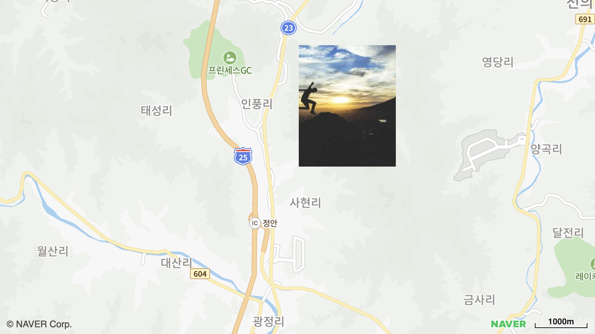

# 지상 오버레이 표시하기

위도/경도 좌표에 연동된 이미지 오버레이를 생성하는 예제입니다.



```svelte
<script>
import { NaverMap, NaverGroundOverlay, createMapScript } from "svelte-naver-maps";
	
createMapScript({ clientId: "YOUR_NAVER_MAP_CLIENT_ID" });

const mapOptions = {
  width: "100%",
	height: "400px",
	latitude: 36.634249797,
	longitude: 127.129160067,
  zoom: 13,
};
</script>

<NaverMap mapOptions={mapOptions}>
  <NaverGroundOverlay
    url="https://picsum.photos/200/300"
    bounds={{
      minPoint: { latitude: 36.634249797, longitude: 127.129160067 },
      maxPoint: { latitude: 36.654249797, longitude: 127.149160067 },
    }}
  />
</NaverMap>
```