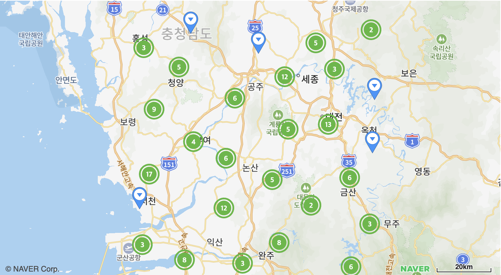

# 마커 클러스터화하기

지도 위에 많은 마커가 표시될 때 마커를 그룹화하여 나타냅니다.



```svelte
<script>
import { NaverMap, NaverGroundOverlay, createMapScript } from "svelte-naver-maps";
	
createMapScript({ clientId: "YOUR_NAVER_MAP_CLIENT_ID" });

const range = (start: number, end: number) => Array.from({ length: end - start + 1 }, (_, i) => start + i);

const mapOptions = {
  width: "100%",
  height: "400px",
  latitude: 36.634249797,
  longitude: 127.129160067,
  zoom: 13,
};

const LATITUDE = 36.634249797;
const LONGITUDE = 127.129160067;

const markerPoints = range(0, 200).map((_) => ({
  latitude: LATITUDE + Math.random() - 1,
  longitude: LONGITUDE + Math.random() - 0.5,
}));
</script>

<NaverMap mapOptions={mapOptions}>
  <NaverMarkerCluster>
    {#each markerPoints as { latitude, longitude }, i}
      <NaverMarker key={i} latitude={latitude} longitude={longitude} />
    {/each}
  </NaverMarkerCluster>
</NaverMap>
```